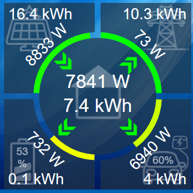
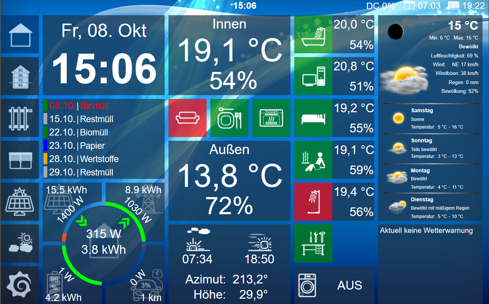

# "Widget" zur Visualisierung der Basis-Daten der Photovolataik-Gesamtanlage auf dem Homescreen

## Einleitung

Da es mehrere Anfragen gab, wie ich das Widget umgesetzt habe, stelle ich die Umsetzung hier zur Verfügung. Es ist eine anonymisierte 1:1 Kopie meiner Umsetzung. Ich versuche, grob zu erklären, was ich gemacht habe. Die Daten müssen aber händisch für das eigene Setup angepasst werden.

## Motivation

Mir war wichtig, ein Widget auf dem Homescreen zu haben, über das man alle wichtigen Daten auf einen Blick sieht. Wie das gesamte View vom Homescreen aussieht, also wie das Widget im Gesamtzusammenhang wirkt, sieht man auf dem Bild ganz am Ende. Das Widget ist natürlich hochgradig an den Stil meiner Visualisierung angepasst, die sich etwas an das Kacheldesign von Windows anlehnt.

## Erläuterung der Anzeige

Die Anzeige ist in fünf Bereiche aufgeteilt:

1. Links oben: Photovoltaik-Anlage: Anzeige des laufenden Tagesertrags und der aktuellen DC-Leistung. Balken zeigt die aktuelle Effizienz bezogen auf die Peakleistung an. Der Pfeil ist immer grün Richtung Haus oder versteckt, wenn die Leistung vom Dach weniger als 100 W beträgt.
2. Rechts oben: Anzeige eingespeiste oder bezogene Leistung bzw. Energie des laufenden Tages. Togglet entsprechen, was gerade aktuell ist. Pfeil entsprechend grün Richtung Netz, wenn Einspeisen und rot Richtung Haus, wenn Bezug. Balken gibt die Autarkie des laufenden Tages an.
3. Links unten: Batterie-Daten. Leistung und Energie von Laden bzw. Entladen des laufenden Tages, je nach dem, was gerade aktuell ist. Pfeile entsprechend. grün Richung Batterie beim Laden  und rot Richtung Haus beim Entladen. SoC der Batterie als Blaken und Wert, Batteriesymbol ändert sich entsprechend SoC. Hier gibt es noch einen versteckten Button. Klickt man drauf, öffnet sich ein kleines View im Popup, über das man die Ladesteuerung regeln kann. Balken gibt den SoC an.
4. Rechts unten: Fahrzeug. Lademanagement über evcc. Pfeil Richtung Fahrzeug ist gelb (PV only), grün (PV + min) oder rot (sofort) je nach Lademodus. Während des Ladevorgangs wird die aktuelle Ladeleistung und -energie angezeigt, ansonsten die aktuelle Reichweite. SoC-Anzeige über Balken und Wert. Hier gibt es noch einen versteckten Button, der evcc in einem popup öffnet.
5. Mittig: Daten vom Haus, also aktueller Gesamtverbrauch und Gesamtenergie des Tages (abzgl. EV-Fahrzeug).

## Mein Setup

Hier beschreibe ich kurz mein aktuelles Setup und wie ich die jeweiligen Daten beziehe:

* Wechselrichter: Fronius GEN24 8.0 Plus
* Batterie: BYD HVS 7.7 kW
  * Datenquelle: modbus TCP Adapter von iobroker
* Wallbox: go-e charger HOMEfix 11 kW
  * Datenquelle: go-e Adapter von iobroker
* Fahrzeug: Mercedes-Benz A-Klasse A250e Hybrid
  * Datenquelle: mercedes me Adapter von iobroker

## Umsetzung

Ein paar Worte zur Umsetzung:

Script Energie.js:
Zeilen 1 - 24 dienen dazu, sicherzustellen, dass die Werte, die asynchron über modbus TCP reinkommen, synchron sind. Ich möchte hier nicht näher darauf eingehen. Die Anregung stammt nicht von mir, sondern aus dem [iobroker Forum](https://forum.iobroker.net/topic/45749/wie-mehrere-werte-nach-%C3%A4nderung-synchron-verrechnen)

function processRawValues führt alle Berechnungen durch. Dabei werden aus den Rohwerten vom modbus TCP einige Sekundärdaten berechnet und in den entsprechenden Datenpunkt geschrieben. Für die Balken ist der Datenpunkt "0_userdata.0.Energie.VisHtml_Overview" zuständig, der mit SVG arbeitet. Die anderen beiden Funktionen dienen nur dazu, die Koordinaten der Balken für SVG-Path zu berechnen. Der Wert von "0_userdata.0.Energie.VisHtml_Overview" wird dann über ein Widget in VIS eingefügt. Zeile 55/56 dient nur dazu, während des Erstellens zwei gelbe Diagonalen anzuzeigen, um die Texte und Pfeile mittig auszurichten.

Der Rest passiert rein im VIS. Der statische Teil der Grafik wurde ebenfalls in SVG umgesetzt über ein HTML Widget. Welcher Pfeil und welcher Wert angezeigt wird, wird über die Sichtbarkeit geregelt. Das Batterie-Image wird ebenfalls passend zum SoC über einen Datenpunkt über folgenden Code in einem anderen Script geändert (kann man sicher auch im obigen Script machen):

```javascript
var SoC = parseInt(getState('modbus.0.holdingRegisters.1.40351_ChaState').val);
if(SoC > 85) { setState('0_userdata.0.Energie.Speicher.VisImage','/icons-mfd-svg/measure_battery_100.svg',true); }
else if(SoC > 65) { setState('0_userdata.0.Energie.Speicher.VisImage','/icons-mfd-svg/measure_battery_75.svg',true); }
else if(SoC > 40) { setState('0_userdata.0.Energie.Speicher.VisImage','/icons-mfd-svg/measure_battery_50.svg',true); }
else if(SoC > 15) { setState('0_userdata.0.Energie.Speicher.VisImage','/icons-mfd-svg/measure_battery_25.svg',true); }
else { setState('0_userdata.0.Energie.Speicher.VisImage','/icons-mfd-svg/measure_battery_0.svg',true); }
```

Die Grafiken und Pfeile stammen teils aus vis Adaptern, teils aus dem Internet zusammengesucht. Ich verzichte daher darauf, diese hier einzubinden. Das Widget kann so oder so nicht 1:1 übernommen werden und muss angepasst werden.


So sieht der gesamte Homescreen bei mir aus:
